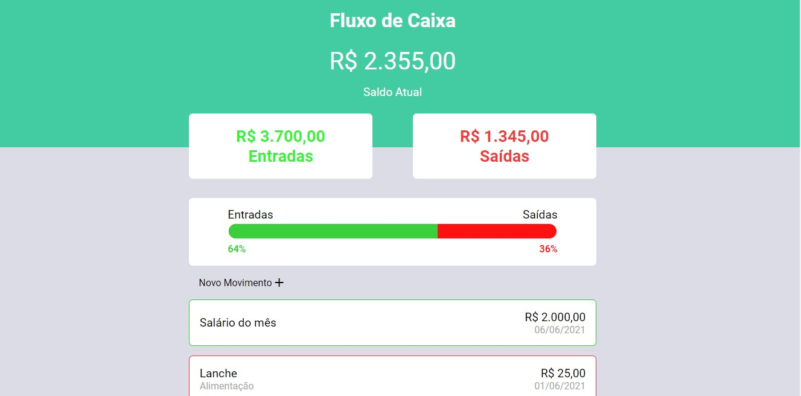
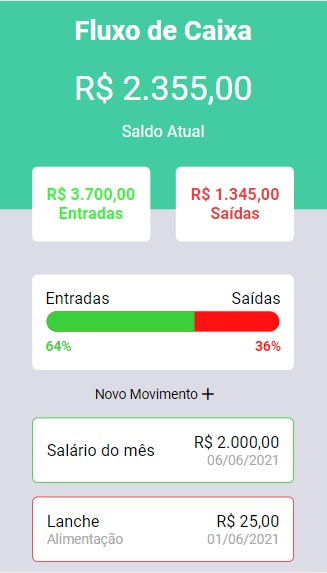

# FLUXO DE CAIXA 💰
  
## Descrição
 Controle de Fluxo de caixa

## 💻📱 Preview
<a href="">Acesse</a>
<div style="display: flex; margin-bottom: 1rem">
  
  
</div>

## 🔨 Tecnologias Utilizadas
- [HTML](https://developer.mozilla.org/pt-BR/docs/Web/HTML)
- [SASS](https://sass-lang.com/)
- [JAVASCRIPT](https://developer.mozilla.org/pt-BR/docs/Web/JavaScript)
- [JSON-SERVER](https://github.com/typicode/json-server)

## ⚙️ Executando o projeto

Como foi utilizado a biblioteca [JSON-SERVER](https://github.com/typicode/json-server) para ter uma API oculta é necessário inicar com o comando abaixo no diretório do projeto: 

```bash
json-server ./src/server.json --port 3333
```

Observação: para executar o comando acima é necessário que tenha instalado globalmente o JSON-SERVER na sua máquina.

Em seguida abra o index.html no seu navegador. 

## 📈 O que eu aprendi

Reforcei conceitos de HTML, utilizei o pré-processador [SASS](https://sass-lang.com/) para aprender um pouco mais sobre o mesmo, para isso assisti uma aula do [Mayk Brito](https://github.com/maykbrito) no [Youtube](https://www.youtube.com/watch?v=BaI8dHUthLA) e com ela pude colocar em prática alguns conceitos, como:

 -Variáveis: fiz a definição das cores da utilizadas na aplicação através de variáveis, dessa forma caso precise ser feita alguma alteração na paleta, só precisamos modificar nas variáveis e a alteração se aplica por todo o código;
 
 -Mixins: permitem a definição de estilos que podem ser reutilizados por todo o código, no meu caso utilizei para definir o flexbox, passando como argumento apenas os itens que poderiam ser diferentes, era algo que se repetia muito no código e com o mixins pude fazer essa refatoração, posteriormente vi que poderia ter utilizado uma outra abordagem do SASS que é o conceito de herança, daria o mesmo efeito;
 
 Absorvi outros conceitos não colocados em prática nesse projeto, porém posso dizer que gostei bastante de utilizar o SASS principalmente pelo fator de encadeamento, torna a leitura e escrita do código bem mais fluida e legível em comparação ao CSS tradicional, foi uma ótima experiência.

No Javascript, treinei novamente o conceito de DOM, criação de objetos, funções, refatoração do código, o uso de alguns métodos como: toFixed(), toLocaleString(), toLocaleDateString(), parseFloat(), que foram utilizadas para tratamento dos dados com relação ao formato, de data, moeda, notação. 
Por fim, utilizei o JSON-SERVER que é uma biblioteca capaz de criar uma API fake com dados mockados para que possamos trabalhar com as requisições, para realizá-las fiz uso do AXIOS que é um cliente HTTP para fazer requisições.

